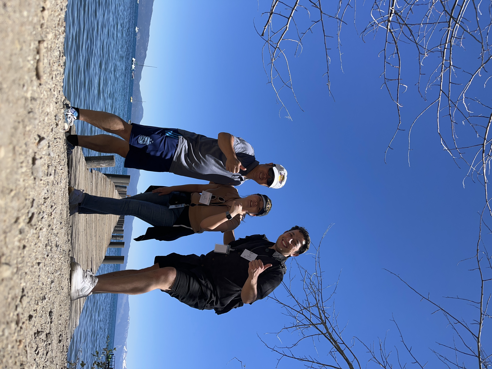

---
title: 2023 Conference on Implantable Auditory Prostheses
date: 2023-07-21
author: Niyazi Arslan
institution: Arizona State University
image:
  caption: 'Image credit: [**Markus Spiske**](https://unsplash.com/photos/5mnldzML7OU)'
  placement: 2 
---  

The Auditory Implant Lab participated in #CIAP2023 <a href="http://www.ciaphome.org/programs.html">, where we had the honor of presenting four insightful posters and delivering one podium presentation. Grateful for the opportunity to contribute to the conference and share our research findings.

## Slideshow: Highlights from CIAP2023

<!-- Add your slideshow here -->
<figure class="image-slider">
  
  
  
  
</figure>

